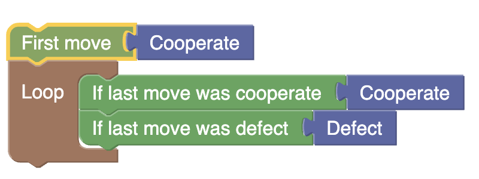

# BlocklyPrisonersDilemma

https://github.com/alexhkurz/BlocklyPrisonersDilemma

(part of my Programming Languages course at Chapman University)

## Introduction

An example of how to tie a Blockly DSL to a backend that can be communicated with via HTTP requests.



This repository provides a rudimentary DSL for designing a strategy that plays an [iterated prisoner's dilemma](https://en.wikipedia.org/wiki/Prisoner's_dilemma#The_iterated_prisoner's_dilemma). There are currently only [2 players](https://github.com/alexhkurz/BlocklyPrisonersDilemma/blob/61eb62afc027e9879979055424981e01eeb9b42a/src/server/game_logic.js#L4) allowed. The implemented [payoff matrix](https://github.com/alexhkurz/BlocklyPrisonersDilemma/blob/61eb62afc027e9879979055424981e01eeb9b42a/src/server/game_logic.js#L6) is based on payoffs $3>2>1>0$. The game always runs for [`numberOfRounds`](https://github.com/alexhkurz/BlocklyPrisonersDilemma/blob/61eb62afc027e9879979055424981e01eeb9b42a/src/server/game_logic.js#L16) rounds.

### Limitations

- The DSL is quite minimal; many interesting strategies cannot be expressed.
- The number of rounds is fixed but should be probabilistic.
- The number of players is 2.
- Sometimes, only the second player gets the result of the game.
- A third player can only join if one of the first two players leaves the game voluntarily and explicitely. The only other way to accommodate new players is for the admin to restart the server.
- There is no support for [tournaments](https://cs.stanford.edu/people/eroberts/courses/soco/projects/1998-99/game-theory/axelrod.html) or for keeping stats.

### Functionality

- *Register* (makes you known as Player 0 or Player 1 to the server).
- Design a strategy by dragging blocks from the toolbox to the workspace.
- *Send Blocks* to server. After Player 0  and Player 1 sent their strategy, the server plays them against each other. The result is sent back to (at least) one of the players.
- *Leave* allows another player to join.
- It is possible to *Save Blocks* and to *Load Blocks*.

### To see what it does

Go to http://35.91.83.141/ in two different browsers. [^AWS]

[^AWS]: I created this AWS instance for teaching my class. I do not promise to maintain it in the future.

You can design a strategy and play an iterated prisoner's dilemma against your opponent.

This has been tested only for [Tit-for-Tat](img/TitForTat.png) and only for two players.

## To install locally

In class we worked through this and the next section.

Fork this repo. Make a local copy of your fork (eg using `git clone` from your commandline).

Requires [nodejs](https://nodejs.org/en/download).

In the root of your local copy of your fork run:

```
cd src/server
npm install
node server.js
```

Once you followed the steps above, you should be able to access http://localhost:3000/ .

If you have questions, raise an [issue](https://github.com/alexhkurz/BlocklyPrisonersDilemma/issues). Make an improvement proposal to my code and submit it to me as a [pull request](https://github.com/alexhkurz/BlocklyPrisonersDilemma/pulls).

## Understanding the Backend with the VSCode Debugger

Being able to work with a debugger is an essential skill. We went through the following in detail in class.

Make sure to open your local copy of your fork in VSCode using "Open Folder...". Then click on the "Run and Debug" icon (or use shift-command-D) and start the "Debug server" with the green play button. Open `src/server/game_logic.js` and set a breakpoint at `runGame``. Open a "New Terminal" and observer the localhost URL in the "DEBUG CONSOLE". Open this URL in two different browsers and start playing the game. After both players hit "Send Blocks" VSCode should stop at the breakpoint. Now guide the execution with "Step Over" and "Step Into". Observe the value of the variables on the top left. You can also use the "+" next to "WATCH" to follow particular variables of your choice. Before taking a step formulate an expectation and take the time to check whether the result of the next step agrees with your expectation. If not, you either found a bug or you learned sth interesting about how the program works.

**Homework:** (Checkout branch `homework` for this.) In `src/client/index.html` find the "endpoints" that are triggered by each button, for example, `/execute` for "Send Blocks". We want, in particular, use the debugger to learn what happens when a user clicks "Send Blocks". For this purpose, set a breakpoint at the corresponding endpoint in `src/server/server.js` (the line after `app.post('/execute'` should do fine). Use the debugger to step through the code and explain what happens. Under which conditions do both players get the result of the game? Why can it happen that only the second player gets the result? What would be a way to improve on this? Feel free to use AI to help with understanding the code but answer the questions in your own words. Describe how you used the debugger and what you learned from using it. 

## To deploy at AWS

This is just a rough run down, we didn't go through this in class.

Create an AWS instance (I selected all the default settings as of Oct 2023).

In a terminal on your machine log into your AWS instance:

```
ssh -i blocklyPrisonersDilemma.pem ec2-user@XXX.amazonaws.com
# Install and start apache
sudo yum update -y  
sudo yum install httpd -y  
sudo systemctl start httpd
sudo systemctl enable httpd
# Install node
https://docs.aws.amazon.com/sdk-for-javascript/v2/developer-guide/setting-up-node-on-ec2-instance.html
curl -o- https://raw.githubusercontent.com/nvm-sh/nvm/v0.39.5/install.sh | bash
. ~/.nvm/nvm.sh
nvm install --lts
npm install pm2 -g
```

To connect the apache server with the nodejs server we need a config file. Create `my.conf`

```
<VirtualHost *:80>
    ServerName 35.91.83.141
    ProxyRequests Off
    ProxyPreserveHost On
    <Location />
        ProxyPass http://localhost:3000/
        ProxyPassReverse http://localhost:3000/
    </Location>
</VirtualHost>
```


Copy files to AWS
```
scp -r -i blocklyPrisonersDilemma.pem my.conf ec2-user@XXX.amazonaws.com:/home/ec2-user
scp -r -i blocklyPrisonersDilemma.pem client ec2-user@XXX.amazonaws.com:/home/ec2-user
scp -r -i blocklyPrisonersDilemma.pem server ec2-user@XXX.amazonaws.com:/home/ec2-user
```

In your AWS instance run:
```
sudo mv my.conf /etc/httpd/conf.d/
cd server
npm install
pm2 start server.js
```
